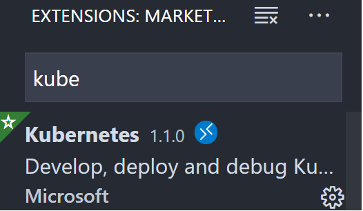
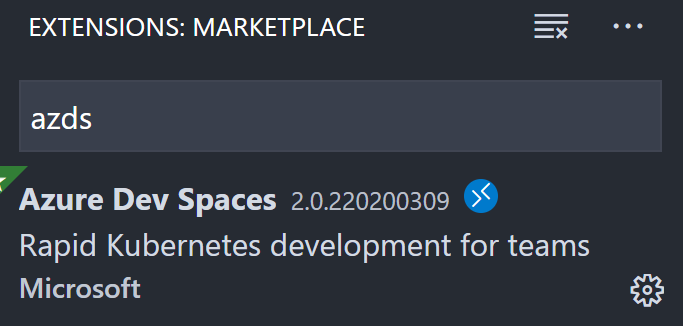

# Lab Guide - Advanced Kubernetes

## Exercise 1 - Working with Init Containers

### Steps

1. Deploy the Pod that has both regular/application
container and the init container defined. 

    ```bash
    # review the manifest
    cat ./assets/lab-04/init.yaml

    # apply the configuration
    kubectl apply -f ./assets/lab-04/init.yaml
    ```

    > Notice the use of **initContainers** section with the command the checks if **nginx** web server is accessible. Until it's not, init container will make sure that application container, which is busy box container, won't run. 

2. You should now check the status of the Pod. 

    ```bash
    kubectl get pod myapp-pod
    ```

    > Notice that the status of **myapp-pod** shows **Init:0/1**. This means that 0 out of 1 init containers are still running. Until init container's condition is satisfied the application pod won't run.  
    > 
    > You can check what's going on inside the Pod by running the command: ```kubectl describe pod myapp-pod```
    >
    > Scroll down to the conditions section within the output.

1. Notice that the **myapp-container** is not initialized yet. This is exactly what you expect because init container is still running. Review the logs to verify that.

    ```bash
    kubectl logs myapp-pod -c init-ngservice
    ```

    > You should see "**Waiting for ngservice to come up**" message in thelogs (ignore "**sh: 200: unknown operand**" message as it's not relevant).  

1. To enable the init container to complete we need to create the **ngservice**. It's going to create a **nginx** service and a service. The service endpoint, once up and running, will satisfy the init container condition.

    ```bash
    kubectl apply -f ./assets/lab-04/myservice.yaml
    ```

1. After a couple of minutes, check the Pod's status:

    ```bash
    kubectl get pod myapp-pod
    ```

    > Notice that **myapp-pod** is now showing **Running** status (previously its **Init:0/1**), This means init container has completed its job and is terminated.  

1. Now, check the logs for application container.

    ```bash
    kubectl logs myapp-pod
    ```

## Exercise 2 - Working with PostStart Container Hooks

### Steps

1. Review the contents of "./assets/lab-04/hooks.yaml"

    ```bash
    cat ./assets/lab-04/hooks.yaml
    ```

2. Run the following command, to create a Pod with hook.  

    ```bash
    kubectl apply -f ./assets/lab-04/hooks.yaml
    ```
    
3. Wait for 5 seconds and then run the command to view Pod details.

    ```bash
    kubectl describe pods hooks
    ```

    > Scroll down and locate the **Events** section. 
    >
    > The PostStart hook first echoed a message, then slept for 3 seconds and finally return an exit code -1. Since the exit code is non-zero the container was killed and re-created again. Initially, you will see **PostStartHookError** within the events section. However, as PostHook will run again and once again returns exist code -1, the container will be killed again and re-created.  

4. Watch the Pod restart, every time the PostStartHookError error occurs.

    ```bash
    kubectl get pods hooks -w
    ```

## Exercise 3 - Working with VS Code

### Steps

1. Install VS Code from https://code.visualstudio.com/ 

2. Go to Extensions (ctrl + shift + x) and install `Kubernetes` Extension 

    

3. Click on the Kubernetes Icon from left panel and connect to existing cluster. (click on `...` and select `Add Existing CLuster` )

    

4. Explore the cluster and workloads created so far.

## Exercise 4 - Get Started with Azure Dev Spaces

### Steps

1. Enable Azure Dev Spaces using the cli. This will also install `azds` cli which is required to work with aks dev spaces.

    ```bash
    az aks use-dev-spacs -g <resource-group-name> -n <aks-cluster-name>
    ```

    Choose `y` when prompted to create Azure Dev Spaces Controller

    Provide a name for the namepsace (for e.g. 'develop' when prompted for `type a number or a new name:` and choose `0` when prompted to select a parent.

2. Make sure the newly created devspace is selected.

    ```bash
    azds space list
    ```
    There should be asterisk next on left of the selected dev space.

    >Note: If you receive an error message such as `command not found`, it's likely because the azds extension is not fully installed. Try restarting the terminal or install `azds cli` from [here](https://docs.microsoft.com/bs-latn-ba/azure/dev-spaces/how-to/install-dev-spaces#install-the-client-side-tools)

3. Create a new dotnet web application. 

    Install latest stable (3.1.x) dotnet core sdk from [here](https://dotnet.microsoft.com/download) if it's not already installed. 

    ```bash
    dotnet new webapp -n <webapp-name>
    ```

    Navigate / `cd` into <webapp-name> and Open it on vs code by typing `code .` in the terminal. If you're prompted to install required assets for `c#`, select `yes`. 
    
    > Note: Ensure `C#` extension is installed on vs code. Install it otherwise.  

    

4. Install azure devspaces extension for vs code either by selecting extensions or from [here](https://marketplace.visualstudio.com/items?itemName=azuredevspaces.azds)

    You may need to `reload` vs code after installing the extension.

    

5. Open Command Palette on vs code by using the shortcut `ctrl + shift + p` and type `azds`

    From the results, choose `Azure DevSpaces: Prepare Configuration` option. This will run `azds prep` behind the scenes and will also setup `launch` config for debugging.

    

    Choose `yes` when prompted to make the endpoint external. This is because for this lab, we will explore how to debug apps using their public endpoint. 

    

    Choosing `no` here would mean the service will be private and debugging will be possible through port-forwarding into localhost. 

    
    
    >Note: In an actual development environment, steps must be taken to ensure https and authentication mechanisms are correctly setup prior to exposing any public endpoints for debugging.

    Notice the new files that are created. These include a dockerfile, helm charts, azds.yaml and launch configs.    

    Place a breakpoint in `OnGet` method on `Pages/index.html.cs`  
    
6. Navigate to Debug option on left panel, (shortcut: ctrl + shift + d)

    Choose `.Net Core Launch (AZDS)` to debug the app.

    

    >It will take a few minutes the first time to sync the files, build and deploy the app on kubernetes.

    If debugger exits unexpectedly the first time, retry a couple more times.

    >You should be able to see a public uri for the app ending with `.azds.io` appearing on the output.
    
    >If it doesn't, type `azds list-uris` in a separate terminal session and copy the endpoint of your app.

    Paste the endpoint in a browser and notice the breakpoint getting hit on vscode. Step over the breakpoint and ensure the page is rendered on the browser.

    Stop debugging. And from terminal set to the <app-name> directory, type `azds down` to tear down your environment on aks. 

    Do another `azds list-up --all` to confirm.


7. For debugging slightly more advanced scenarios such as multi-service apps with public web-app backed by a private web-api, refer to https://docs.microsoft.com/en-us/azure/dev-spaces/multi-service-netcore


    
